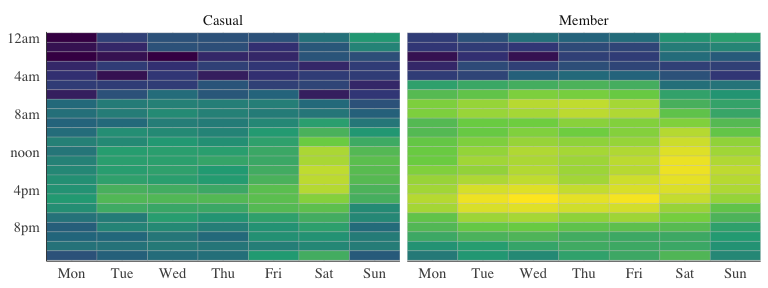
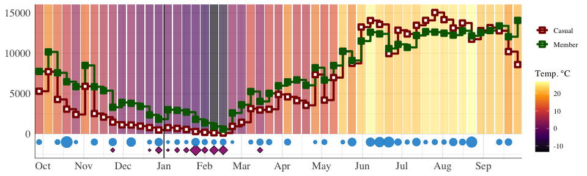
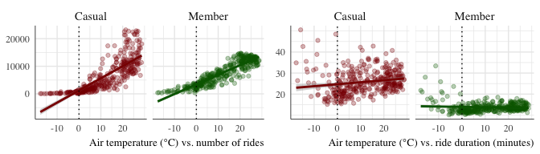
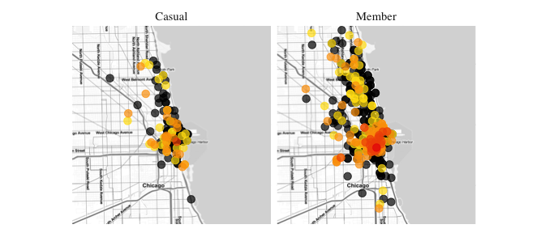
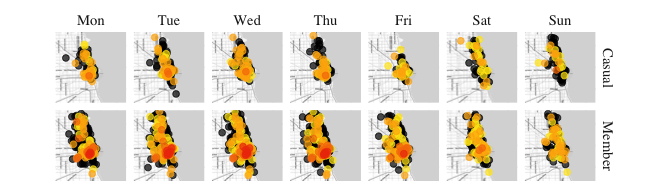
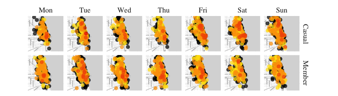

# Cyclistic

-   **Anar Seyf** \| <anar.seyf@gmail.com>
-   Capstone project \| Google Data Analytics course #8 \| Coursera
-   October 2021
-   Source code:
    [github.com/anarseyf/cyclistic](github.com/anarseyf/cyclistic)

------------------------------------------------------------------------

## Introduction

This report is the capstone project for the Google Data Analytics
professional certificate on Coursera [**\[1\]**](#links). The starting
point is data from Cyclistic, a bike-sharing company which operates a
network of classic and electric bicycles and docking stations in
Chicago. The goal is to understand usage patterns between **Casual**
riders (those who pay for single rides or day passes) and **Members**
(those who purchased an annual membership), and to provide
recommendations to the Cyclistic marketing team on how to convert casual
riders into members.

------------------------------------------------------------------------

## Data

Our main dataset contains individual ride records over a twelve-month
period—October 2020 to September 2021, inclusive—provided in monthly
.csv files [**\[2\]**](#links). This amounts to over 5 million rows with
these columns:

-   unique ride ID;
-   status (member or casual)
-   start and end time;
-   start and end docking station (ID and name);
-   start and end latitude/longitude;
-   bicycle type (classic, docked, electric);

The individual records are aggregated into hourly, daily, and weekly
tables, and grouped by status (member vs. casual). For example, the
daily aggregates table consists of 730 entries (365 for Members and
Casual riders each) with columns for average daily ride count and
average duration.

See [**Appendix**](#appendix) for details on tools used and data cleanup
steps.

------------------------------------------------------------------------

## Analysis

### 1. Members ride more often, casual users ride for longer.

An average ride is about **14 minutes** long for Members and **28
minutes** long for Casual riders. Members make an average of **7,479**
rides per day, compared to **6,362** for Casual riders. (The number of
distinct riders is unavailable in the data, so we can only refer to the
overall groups. Daily totals can provide a rough approximation, but only
within the order of magnitude.)

Ride volume is lowest in February and highest in July-August. Casual
ride volume exceeds that of Members in the summer months only.

<table class="table" style="margin-left: auto; margin-right: auto;border-bottom: 0;">
<caption>
Average daily number of rides
</caption>
<thead>
<tr>
<th style="text-align:left;">
</th>
<th style="text-align:right;">
Oct
</th>
<th style="text-align:right;">
Nov
</th>
<th style="text-align:right;">
Dec
</th>
<th style="text-align:right;">
Jan
</th>
<th style="text-align:right;">
Feb
</th>
<th style="text-align:right;">
Mar
</th>
<th style="text-align:right;">
Apr
</th>
<th style="text-align:right;">
May
</th>
<th style="text-align:right;">
Jun
</th>
<th style="text-align:right;">
Jul
</th>
<th style="text-align:right;">
Aug
</th>
<th style="text-align:right;">
Sep
</th>
</tr>
</thead>
<tbody>
<tr>
<td style="text-align:left;">
Casual
</td>
<td style="text-align:right;">
4,573
</td>
<td style="text-align:right;">
2,888
</td>
<td style="text-align:right;">
 956
</td>
<td style="text-align:right;">
 575
</td>
<td style="text-align:right;">
 354
</td>
<td style="text-align:right;">
2,677
</td>
<td style="text-align:right;">
4,490
</td>
<td style="text-align:right;">
8,159
</td>
<td style="text-align:right;">
12,147
</td>
<td style="text-align:right;">
14,044
</td>
<td style="text-align:right;">
13,131
</td>
<td style="text-align:right;">
11,962
</td>
</tr>
<tr>
<td style="text-align:left;">
Member
</td>
<td style="text-align:right;">
7,676
</td>
<td style="text-align:right;">
5,614
</td>
<td style="text-align:right;">
3,220
</td>
<td style="text-align:right;">
2,502
</td>
<td style="text-align:right;">
1,380
</td>
<td style="text-align:right;">
4,592
</td>
<td style="text-align:right;">
6,582
</td>
<td style="text-align:right;">
8,705
</td>
<td style="text-align:right;">
11,754
</td>
<td style="text-align:right;">
12,058
</td>
<td style="text-align:right;">
12,431
</td>
<td style="text-align:right;">
12,863
</td>
</tr>
</tbody>
<tfoot>
<tr>
<td style="padding: 0; " colspan="100%">
 (In this table and in Table 3, the larger of the two numbers
for each month is in italics.)
</td>
</tr>
</tfoot>
</table>

Ride duration is nearly flat for Members throughout the year; for Casual
riders it increases by a few minutes in the summer months.

<table class="table" style="width: auto !important; margin-left: auto; margin-right: auto;border-bottom: 0;">
<caption>
Average ride duration (minutes)
</caption>
<thead>
<tr>
<th style="text-align:left;">
</th>
<th style="text-align:right;">
Oct
</th>
<th style="text-align:right;">
Nov
</th>
<th style="text-align:right;">
Dec
</th>
<th style="text-align:right;">
Jan
</th>
<th style="text-align:right;">
Feb
</th>
<th style="text-align:right;">
Mar
</th>
<th style="text-align:right;">
Apr
</th>
<th style="text-align:right;">
May
</th>
<th style="text-align:right;">
Jun
</th>
<th style="text-align:right;">
Jul
</th>
<th style="text-align:right;">
Aug
</th>
<th style="text-align:right;">
Sep
</th>
</tr>
</thead>
<tbody>
<tr>
<td style="text-align:left;">
Casual
</td>
<td style="text-align:right;">
24
</td>
<td style="text-align:right;">
24
</td>
<td style="text-align:right;">
22
</td>
<td style="text-align:right;">
21
</td>
<td style="text-align:right;">
33
</td>
<td style="text-align:right;">
27
</td>
<td style="text-align:right;">
28
</td>
<td style="text-align:right;">
29
</td>
<td style="text-align:right;">
28
</td>
<td style="text-align:right;">
27
</td>
<td style="text-align:right;">
25
</td>
<td style="text-align:right;">
24
</td>
</tr>
<tr>
<td style="text-align:left;">
Member
</td>
<td style="text-align:right;">
13
</td>
<td style="text-align:right;">
13
</td>
<td style="text-align:right;">
12
</td>
<td style="text-align:right;">
13
</td>
<td style="text-align:right;">
18
</td>
<td style="text-align:right;">
13
</td>
<td style="text-align:right;">
14
</td>
<td style="text-align:right;">
14
</td>
<td style="text-align:right;">
14
</td>
<td style="text-align:right;">
14
</td>
<td style="text-align:right;">
14
</td>
<td style="text-align:right;">
13
</td>
</tr>
</tbody>
<tfoot>
<tr>
<td style="padding: 0; " colspan="100%">
Note: 
</td>
</tr>
<tr>
<td style="padding: 0; " colspan="100%">
 February has an abnormal spike in ride duration. It may be
partly due to low ride volume and thus higher variance in the data, but
is otherwise not readily explainable here. It is likely to be
weather-related, perhaps due to difficulties of reaching a docking
station.
</td>
</tr>
</tfoot>
</table>

### 2. Members ride all week, casual riders prefer weekends.

Ride volume remains nearly flat for Members through the week, reducing
only on Sundays. Casual users do the most riding over the weekend,
peaking on Saturdays.

<table class="table" style="width: auto !important; margin-left: auto; margin-right: auto;">
<caption>
Average daily number of rides
</caption>
<thead>
<tr>
<th style="text-align:left;">
</th>
<th style="text-align:right;">
Mon
</th>
<th style="text-align:right;">
Tue
</th>
<th style="text-align:right;">
Wed
</th>
<th style="text-align:right;">
Thu
</th>
<th style="text-align:right;">
Fri
</th>
<th style="text-align:right;">
Sat
</th>
<th style="text-align:right;">
Sun
</th>
</tr>
</thead>
<tbody>
<tr>
<td style="text-align:left;">
Casual
</td>
<td style="text-align:right;">
5,047
</td>
<td style="text-align:right;">
4,763
</td>
<td style="text-align:right;">
4,871
</td>
<td style="text-align:right;">
5,104
</td>
<td style="text-align:right;">
6,421
</td>
<td style="text-align:right;">
9,923
</td>
<td style="text-align:right;">
8,429
</td>
</tr>
<tr>
<td style="text-align:left;">
Member
</td>
<td style="text-align:right;">
7,107
</td>
<td style="text-align:right;">
7,701
</td>
<td style="text-align:right;">
8,002
</td>
<td style="text-align:right;">
7,807
</td>
<td style="text-align:right;">
7,666
</td>
<td style="text-align:right;">
7,550
</td>
<td style="text-align:right;">
6,513
</td>
</tr>
</tbody>
</table>
<table class="table" style="width: auto !important; margin-left: auto; margin-right: auto;">
<caption>
Average ride duration (minutes)
</caption>
<thead>
<tr>
<th style="text-align:left;">
</th>
<th style="text-align:right;">
Mon
</th>
<th style="text-align:right;">
Tue
</th>
<th style="text-align:right;">
Wed
</th>
<th style="text-align:right;">
Thu
</th>
<th style="text-align:right;">
Fri
</th>
<th style="text-align:right;">
Sat
</th>
<th style="text-align:right;">
Sun
</th>
</tr>
</thead>
<tbody>
<tr>
<td style="text-align:left;">
Casual
</td>
<td style="text-align:right;">
28
</td>
<td style="text-align:right;">
25
</td>
<td style="text-align:right;">
24
</td>
<td style="text-align:right;">
24
</td>
<td style="text-align:right;">
26
</td>
<td style="text-align:right;">
30
</td>
<td style="text-align:right;">
32
</td>
</tr>
<tr>
<td style="text-align:left;">
Member
</td>
<td style="text-align:right;">
13
</td>
<td style="text-align:right;">
13
</td>
<td style="text-align:right;">
13
</td>
<td style="text-align:right;">
13
</td>
<td style="text-align:right;">
13
</td>
<td style="text-align:right;">
15
</td>
<td style="text-align:right;">
16
</td>
</tr>
</tbody>
</table>

#### Hourly heatmap

A more detailed view of the data from *Table 3*. The Monday–Friday
pattern for Members closely matches standard working hours; note
especially the peak around 4–5pm. Weekend patterns are closer between
the two groups, apart from volume; note, for example, Saturday evening
activity spilling over into early morning on Sunday.

### 3. Seasons affect ride volume, but average duration remains stable

This section uses the Chicago daily weather dataset from NOAA
[**\[3\]**](#links).

The following chart plots one year of ride data, aggregated by week,
against weather for that week: average daily air temperature (background
colors), cumulative rain, and cumulative snow.

<!-- -->

<table class="table" style="width: auto !important; margin-left: auto; margin-right: auto;border-bottom: 0;">
<caption>
Correlation (r): ride volume vs. weather factors
</caption>
<thead>
<tr>
<th style="empty-cells: hide;border-bottom:hidden;" colspan="1">
</th>
<th style="border-bottom:hidden;padding-bottom:0; padding-left:3px;padding-right:3px;text-align: center; " colspan="4">

Count

</th>
<th style="border-bottom:hidden;padding-bottom:0; padding-left:3px;padding-right:3px;text-align: center; " colspan="4">

Duration

</th>
</tr>
<tr>
<th style="text-align:left;">
</th>
<th style="text-align:right;">
Temperature
</th>
<th style="text-align:right;">
Rain
</th>
<th style="text-align:right;">
Snow
</th>
<th style="text-align:right;">
Wind
</th>
<th style="text-align:right;">
Temperature
</th>
<th style="text-align:right;">
Rain
</th>
<th style="text-align:right;">
Snow
</th>
<th style="text-align:right;">
Wind
</th>
</tr>
</thead>
<tbody>
<tr>
<td style="text-align:left;">
Casual
</td>
<td style="text-align:right;font-weight: bold;">
0.81
</td>
<td style="text-align:right;">
0.00
</td>
<td style="text-align:right;">
-0.20
</td>
<td style="text-align:right;">
-0.20
</td>
<td style="text-align:right;font-weight: bold;">
0.07
</td>
<td style="text-align:right;">
-0.07
</td>
<td style="text-align:right;">
0.16
</td>
<td style="text-align:right;">
-0.05
</td>
</tr>
<tr>
<td style="text-align:left;">
Member
</td>
<td style="text-align:right;font-weight: bold;">
0.91
</td>
<td style="text-align:right;">
-0.01
</td>
<td style="text-align:right;">
-0.29
</td>
<td style="text-align:right;">
-0.22
</td>
<td style="text-align:right;font-weight: bold;">
-0.08
</td>
<td style="text-align:right;">
-0.07
</td>
<td style="text-align:right;">
0.29
</td>
<td style="text-align:right;">
-0.08
</td>
</tr>
</tbody>
<tfoot>
<tr>
<td style="padding: 0; " colspan="100%">
Note: 
</td>
</tr>
<tr>
<td style="padding: 0; " colspan="100%">
 The Pearson correlation coefficient (r) measures how
strongly two sets of data are linearly correlated, from -1 (perfect
negative) to 1 (perfect positive), with 0 indicating no correlation.
Here, for example, ride count is negatively correlated with snow: the
more snow, the fewer rides.
</td>
</tr>
</tfoot>
</table>

Table 5 shows that the number of rides on a given day is strongly—almost
perfectly—correlated with **air temperature** for both groups; duration,
on the other hand, shows almost no correlation. The following plots help
illustrate this relationship. Each circle represents one day; 365
circles for each plot; the diagonal lines represent best linear fit and
confidence intervals.

<!-- -->

**Rain** is more ambiguous: correlation is close to 0. Does this mean
bike-share users in Chicago are indifferent to rain? The more plausible
explanation is that we are at the limits of this dataset. In the
12-month period, 256 days had no recorded rain, and only 16 days had
half an inch or more; on those days, Members rode for 4% less total
time, and Casual riders 6% more, than on days with less rain. In other
words, it did not rain enough to make the relationship clear.

These distributions confirm an observation from section 1: average ride
duration remains nearly flat (more so for Members), but ride volume can
vary significantly.

### 4. Geographical patterns are distinct across the week

The source dataset contains 1288 distinct docking stations. 85% of all
rides have both a start and an end station specified; in this section we
focus on that subset only (the other 15% start and/or end outside of a
docking station). To prevent seasonal trends from complicating the
picture, the data is further filtered to four weeks in the summer (June
1st—June 28th).

### Friday morning (8-10am)

This plot isolates daily and weekly patterns using a heatmap of station
usage.

<!-- -->

Each dot represents a bike docking station. The metric is: *count(rides
ended) – count(rides started)*, for each station, within one hour. Dark
dots indicate more starts than ends, and thus an *outflow* of bike
traffic; colored dots are stations where more rides have ended than
started, or an *inflow* of traffic (redder colors indicate more
arrivals, on a log scale).

In other words: *clusters of “hot” stations indicate areas that people
are cycling into*.

Let’s look at the same pattern across the week (again, these are totals
across a four-week time window).

### Morning (8-9am)

<!-- -->

A distinct weekday pattern emerges. Apart from ride counts (as mentioned
in section 1, Members make more total rides than Casual users), the
“fingerprints” look similar for the two groups. During the work week the
flow is into the center of the city; on weekends the flow is more
dispersed.

### Afternoon (4-5pm)

<!-- -->

In the afternoon the volume of riding spikes (see also the heatmap in
section 2), and also disperses away from center.

------------------------------------------------------------------------

## Conclusions

#### Members use the service as a utility, Casual riders as more of a luxury

Riding a Cyclistic bike is an always-available option to members at no
additional cost. If a bike is available nearby, starting a ride is a
non-issue. Conversely, casual riders face an additional financial
“barrier to entry” before each ride (or each day). The distinctions in
usage (both ride duration and number of rides) are likely explained
mainly by this distinction. A member can use the service for running
small errands or commuting to work. Casual users have to be more
selective in their use.

#### The two groups’ usage patterns overlap.

Weekly and geographical usage patterns for Members and Casual riders
have enough similarities to suggest they represent essentially the same
pool of people, in terms of their travel goals. Both groups ride more in
late afternoon (presumably when their work day ends); both groups ride a
lot on Saturday afternoon; and so on.

------------------------------------------------------------------------

## Recommendations

How to convert existing casual riders into members?

### 1. Nudge casual riders toward memberships with free trials

Make it easy for casual users to consider Cyclistic as a regular
transportation option. Consider removing the main barriers to entry by
allowing them to temporarily gain membership privileges—automatically
and free of charge. For example, turn a single pass into a free weekly
or monthly trial of the membership, send out a promotion for such a
trial, or advertise specific days when these trials will be offered.

### 2. Address specific modes of riding

This analysis suggests the presence of several modes of riding for each
group. The next step is to drill down further and tease out specific
modes and use cases, as well as those currently not feasible or not
considered. Examples:

-   Riding to major sporting events on weekends and avoiding parking
    problems
-   Riding every day during a specific time window
-   Riding longer distances (does the electric bike hold enough charge?)
-   Riding combined with other modes of transport

### 3. Understand obstacles to regular riding and help remove them

Find out if a subset of Casual riders want to become members, but cannot
due to factors other than cost. Does their neighborhood lack docking
stations? Do they need help with planning a safe route? Consider working
with the city on expanding cycling routes and making cycling safer.

------------------------------------------------------------------------

## Appendix

### Limitations and scope

The available dataset does not contain any individual ridership data or
any information on cohorts; seasonal trends could be in part
attributable to membership growth.

Factors out of scope for this study: bike types; external factors beyond
weather (natural disasters, sporting events, road closures); pricing;
individual user profiles; year-over-year trends; other modes of
transport; neighborhood specifics.

### Data cleanup

The following entries were removed:

-   Entries with ride duration of less than 1 minute or negative (end
    time before start time);
-   Entries with ride duration of over 24 hours;
-   A few entries that appeared to be test data;
-   (for the plots in section 4 only) A single outlier, 16 Feb 2021,
    with an abnormally high average duration.

The cleaned result contained 5,051,830 entries, down from 5,136,261 in
the source.

Heatmaps use logarithmic scales to present values differing by several
orders of magnitude.

### Tools used

1.  **Terminal (zsh)**
    -   Download and unzip source data files, calculate lines,
        concatenate into a single file.
2.  **Google Sheets**
    -   Initial exploration of a small subset of the data; sample pivot
        tables. Google Sheets has a limitation of 5 million *cells* (not
        rows) per sheet, so analyzing the full dataset there was not
        realistic.
3.  **BigQuery** and **SQL**
    -   Loaded the full dataset into Google Cloud Platform’s BigQuery;
        analyzed and built aggregates using SQL.
4.  **R programming language**
    -   Plot generation and final data manipulation.
5.  **rmarkdown** and **knitr**
    -   Compilation of the report as PDF and HTML.

### Links

1.  Coursera — Google Data Analytics
    -   <https://www.coursera.org/professional-certificates/google-data-analytics>
2.  Source data from Divvy
    -   <https://divvy-tripdata.s3.amazonaws.com/index.html>
3.  NOAA Chicago daily weather. Collected at O’Hare Airport.
    -   <https://www.ncdc.noaa.gov/cdo-web/datasets/GHCND/stations/GHCND:USW00094846/detail>
4.  BigQuery
    -   <https://cloud.google.com/bigquery>
5.  Pearson correlation coefficient
    -   <https://en.wikipedia.org/wiki/Pearson_correlation_coefficient>
